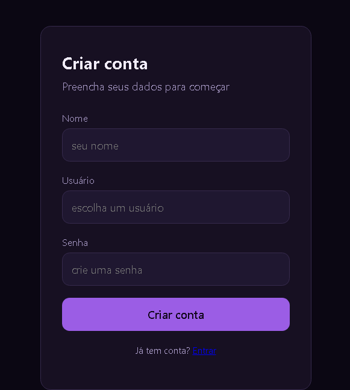
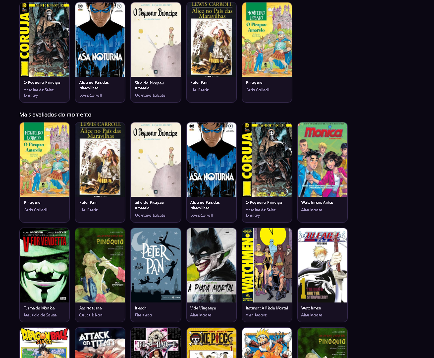
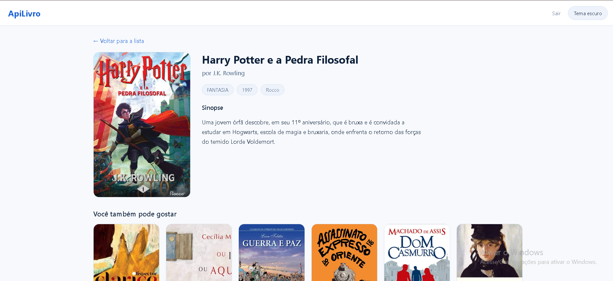
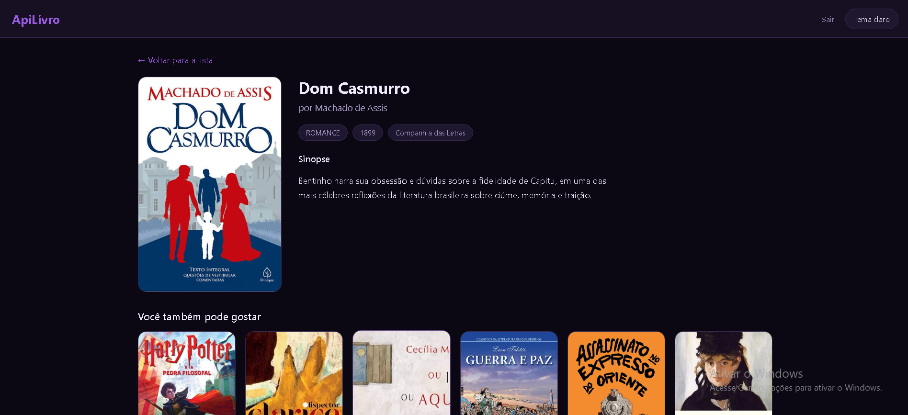

# 📚 ApiLivro

🔗 Repositório: [github.com/RiaanVictor07/Api_De_Livro](https://github.com/RiaanVictor07/Api_De_Livro)

API REST para gerenciamento de um catálogo de livros, com autenticação de usuários. O projeto simula uma plataforma de biblioteca digital, onde é possível cadastrar livros, autoras e editoras, relacioná-los entre si, e navegar por um catálogo através de um front-end conectado à API.

É um **projeto pessoal de estudo**, construído do zero em Java + Spring Boot, cobrindo desde a modelagem do banco de dados até autenticação com tokens JWT.

---

## 🖼️ Telas do projeto

### Login e Cadastro

O usuário pode criar uma conta informando nome, usuário e senha, ou entrar com uma conta já existente. A autenticação é feita via token JWT, gerado pelo backend e usado para validar as requisições seguintes.

  
  

### Home

Após o login, o usuário é recebido com uma mensagem de boas-vindas personalizada com seu nome. A tela lista os livros cadastrados, com busca por nome e filtro por gênero literário.

  

  

### Detalhes do livro

Ao clicar em um livro, o usuário vê a capa, sinopse, autora, editora, ano de publicação e gênero, além de sugestões de outros livros do catálogo. A tela está disponível tanto no tema claro quanto no tema escuro.

  

  

---

## ✨ Funcionalidades

- **CRUD de Livros, Autoras e Editoras**, com relacionamento entre entidades (um livro pertence a uma autora e a uma editora)
- **Cadastro e autenticação de usuários** com login e senha, permitindo criação de conta diretamente pelo front-end
- **Geração e validação de token JWT**, protegendo rotas sensíveis da API e mantendo o usuário autenticado entre requisições
- **Validação de dados de entrada** com anotações como `@NotBlank` e `@NotNull`, garantindo que campos obrigatórios não cheguem vazios ao banco
- **Tratamento centralizado de exceções**, com um handler global que padroniza as respostas de erro (400, 404, 401, 500) em formato JSON consistente, sem expor detalhes internos da aplicação
- **Versionamento de schema de banco de dados com Flyway**, garantindo que a estrutura das tabelas evolua de forma controlada e rastreável junto com o código
- **Configuração de CORS**, permitindo que o front-end se comunique com a API mesmo quando servidos em origens diferentes

---

## 🎨 Front-end

O front-end é responsivo e possui dois temas visuais (claro e escuro, com paletas de azul e roxo, respectivamente), construído com:

- **HTML**
- **CSS**
- **JavaScript**

---

## 🛠️ Tecnologias utilizadas

- **Java 17**
- **Spring Boot 4.1.1**
- **Spring Web** (API REST)
- **Spring Data JPA** + **Hibernate**
- **Spring Security**
- **JWT** (`com.auth0:java-jwt`)
- **PostgreSQL**
- **Flyway** (versionamento de banco de dados)
- **Bean Validation** (`spring-boot-starter-validation`)
- **Lombok**
- **Maven**

### Ferramentas de apoio

- IntelliJ IDEA
- pgAdmin / DBeaver
- Postman

---

## 📌 Status

Projeto em desenvolvimento contínuo, evoluindo aos poucos como parte dos meus estudos em desenvolvimento backend com Java.

---

**Autor:** Rian Victor
